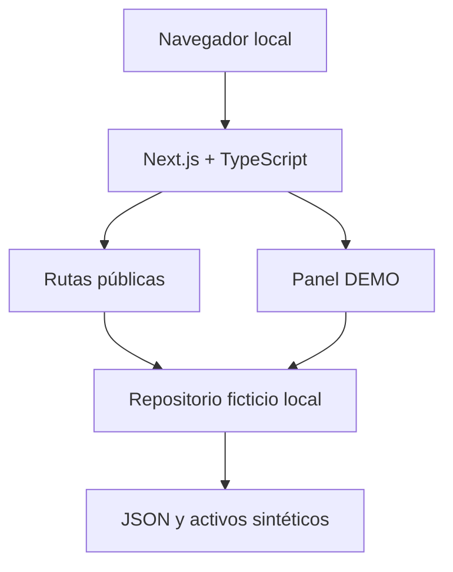
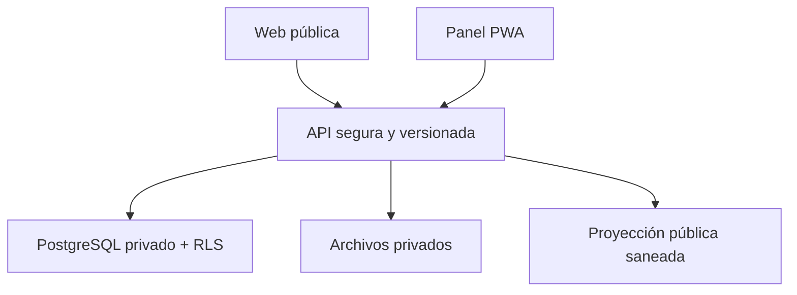

# Documento de Descubrimiento v1 — Plataforma B & B Corretaje

**Versión:** 1.0
**Fecha de consulta y preparación:** 27 de agosto de 2026
**Propietario de producto:** B & B Corretaje
**Marca inicial:** Patricio Baeza Jiménez — B & B Corretaje
**Zona inicial:** Los Ángeles y provincia de Biobío, Chile
**Restricción económica:** presupuesto directo de desarrollo profesional $0
**Estado:** decisiones D0-01 a D0-05 y P1.1 a P1.3 aprobados; sólo P1.4 autorizado

---

## 1. Resumen ejecutivo y reformulación del problema

El encargo no es únicamente una página web. Es la primera etapa de una plataforma
inmobiliaria que debe resolver cuatro problemas conectados:

1. proyectar confianza y presencia profesional para B & B;
2. publicar un catálogo controlado, evitando anuncios inexistentes o fraudulentos;
3. ordenar la información privada y la gestión comercial del corredor;
4. permitir, en el futuro, ofrecer el sistema a otras corredoras sin mezclar datos.

El producto completo requerirá sitio público, panel/CRM, API, base privada,
proyección pública saneada, almacenamiento y futura aplicación móvil. Sin embargo,
construirlo todo antes de validar interés consumiría tiempo y cuotas sin generar
evidencia comercial.

La Fase 1 será por ello un **demostrador comercial local de alta fidelidad**. Mostrará
la experiencia final y sus principios de seguridad, pero no procesará información
real. Su objetivo es ayudar a presentar B & B, conversar con posibles corredores
colaboradores y obtener recursos para dominio, infraestructura y validaciones
posteriores.

### Hipótesis que validará el prototipo

> Propietarios y corredores locales valorarán una plataforma formal que combine
> catálogo verificado, atención humana y administración ordenada, especialmente para
> propiedades rurales y activos especiales, y algunos estarán dispuestos a encargar
> corretajes, colaborar o financiar una implementación piloto.

### Indicadores de validación comercial, fuera del software

- al menos 5 demostraciones guiadas a propietarios o interesados;
- al menos 3 demostraciones a corredores de la zona;
- registro manual de preguntas, objeciones y funciones solicitadas;
- al menos 2 expresiones verificables de interés en colaborar, publicar o pilotear;
- una decisión posterior de `CONTINUAR`, `AJUSTAR` o `DETENER` antes de pagar
  infraestructura.

Estos objetivos no se programan en la aplicación; se medirán en una planilla o acta
separada, sin ingresar datos personales en el prototipo.

---

## 2. Alcance incluido, excluido y futuro

### 2.1 Incluido en el prototipo local

- identidad visual B & B basada en azul marino, rojo burdeos, blanco y variaciones
  accesibles;
- inicio con propuesta de valor y búsqueda destacada;
- catálogo ficticio de venta, arriendo y activos especiales;
- búsqueda y filtros simulados;
- ficha de publicación con ubicación aproximada y nivel de revisión explicado;
- servicios: vender, comprar, arrendar, dar en arriendo, búsqueda, propiedades
  rurales y activos especiales;
- quiénes somos, misión, visión, valores y método de validación;
- contacto y formularios simulados, sin transmisión;
- panel corredor con dashboard, clientes, activos, publicaciones y leads ficticios;
- ciclo de publicación y duración simulados;
- responsive, accesibilidad y ejecución local;
- guía para una demostración comercial de cinco a diez minutos.

### 2.2 Excluido expresamente

- base de datos, almacenamiento remoto o sincronización;
- cuentas, autenticación, MFA o recuperación de contraseña reales;
- RUT, teléfonos, correos, contratos, documentos, direcciones o propiedades reales;
- envío de formularios, correo o mensajes;
- subida o procesamiento de archivos;
- pagos, comisiones, suscripciones o facturación;
- firma electrónica;
- reportes UAF, perfilamiento o listas de vigilancia;
- mapas de terceros o geolocalización real;
- analítica y cookies no esenciales;
- autopublicación de propietarios;
- acceso real de otras corredoras;
- promesas de verificación jurídica, rentabilidad o inexistencia de riesgos.

### 2.3 Futuro condicionado a evidencia

- MVP con API, PostgreSQL, RLS, autenticación y almacenamiento privado;
- PWA instalable para el corredor;
- multiempresa real;
- colaboración, referidos y reparto de comisiones;
- exportación y portabilidad;
- micrositios o marca blanca;
- aplicación móvil;
- módulos de privacidad y cumplimiento;
- integraciones con portales, mapas, mensajería y firma, cada una bajo aprobación.

---

## 3. Personas usuarias y trabajos que necesitan resolver

| Persona | Necesidad principal | Resultado esperado |
|---|---|---|
| Propietario vendedor/arrendador | entregar antecedentes a un corredor confiable sin autopublicarse | contacto humano y publicación controlada |
| Comprador/arrendatario | encontrar alternativas reales y comprensibles | búsqueda rápida y coordinación con corredor |
| Inversionista/empresa | evaluar predios rurales, energéticos o activos especiales | ficha prudente, antecedentes escalonados y NDA cuando proceda |
| Corredor B & B | ordenar captación, publicaciones, leads y seguimientos | panel único y trazabilidad |
| Supervisor/aprobador | evitar publicar información no confirmada | revisión y autorización explícita |
| Corredor colaborador futuro | administrar su cartera sin exponerla a otros | cuenta aislada y reglas claras de leads/comisiones |
| Responsable de privacidad/cumplimiento | controlar finalidad, acceso, retención y reserva | evidencia y permisos restringidos |
| Visitante público | comprender quién es B & B y qué ofrece | navegación simple y señales de seriedad |

### Trabajo comercial principal del prototipo

El demostrador debe permitir que una persona entienda en menos de diez segundos:

- qué ofrece B & B;
- dónde opera inicialmente;
- cómo buscar una propiedad;
- por qué las publicaciones no son abiertas ni anónimas;
- cómo contactar al corredor, aunque el botón sea demostrativo.

---

## 4. Preguntas críticas priorizadas

### Grupo A — modelo comercial y datos

| Pregunta | Recomendación Fase 0 | Estado |
|---|---|---|
| ¿Portal B & B o SaaS desde el inicio? | modelo híbrido progresivo: B & B primero, arquitectura preparada | requiere aprobación |
| ¿Pueden terceros autopublicar? | no; sólo solicitar contacto | resuelto por restricción del propietario |
| ¿Usar datos reales en el prototipo? | no, ni siquiera contactos o propiedades conocidas | requiere ratificación |
| ¿Qué diferencia comercial mostrar? | verificación humana, información prudente y especialidad rural/activos especiales | requiere aprobación |
| ¿Puede B & B ver datos de futuras corredoras? | sólo métricas operativas necesarias y agregadas; nunca cartera completa por defecto | futuro no resuelto |

### Grupo B — producto y operación

| Pregunta | Recomendación | Estado |
|---|---|---|
| ¿Escritorio nativo o PWA? | PWA futura; prototipo web local primero | propuesta |
| ¿Aplicación móvil en MVP? | no; validar PWA móvil antes | propuesta |
| ¿Dirección exacta pública? | no; sólo comuna/sector aproximado autorizado | resuelto |
| ¿Qué propiedades destacar? | casa, departamento, parcela, terreno, predio rural y activo especial | propuesta |
| ¿Qué debe probar el dashboard? | inventario, publicaciones por estado, leads y actividad ficticia | propuesta |

### Grupo C — privacidad, seguridad y cumplimiento

| Pregunta | Recomendación | Estado |
|---|---|---|
| ¿Procesar documentación en Fase 1? | no | resuelto |
| ¿Automatizar UAF? | no; ni siquiera simular un ROS con datos reales | resuelto |
| ¿Usar analítica/cookies? | no en prototipo; reevaluar al publicar | propuesta |
| ¿Permitir eliminar definitivamente? | borrado lógico y retención; borrado físico sólo por flujo autorizado futuro | propuesta |
| ¿Qué significa “verificada”? | mostrar niveles y alcance, nunca garantía absoluta | resuelto |

---

## 5. Comparación de modelos comerciales

| Modelo | Ventajas | Riesgos/costos | Decisión |
|---|---|---|---|
| Portal sólo B & B | sencillo, coherente con la marca, menor riesgo | crecimiento limitado y posible rediseño posterior | válido como primera operación |
| SaaS multiempresa inmediato | propuesta comercial más amplia | seguridad, soporte, contratos y costos antes de validar demanda | no recomendado ahora |
| Híbrido progresivo | B & B opera primero; límites multiempresa se diseñan desde el inicio | exige disciplina para no activar funciones incompletas | **recomendado** |

### Reglas comerciales pendientes para el futuro

- titularidad y reasignación de leads;
- visibilidad de clientes entre colaboradores;
- protección de contrapartes presentadas y anti-elusión;
- referidos y reparto de comisiones;
- exportación al terminar el servicio;
- métricas que puede ver el operador de plataforma;
- planes por empresa, usuario, publicación o suscripción;
- relación responsable/encargado del tratamiento entre plataforma y corredoras.

El prototipo puede mostrar pantallas que anticipen estas capacidades, pero deben llevar
la etiqueta `FUNCIONALIDAD FUTURA — NO OPERATIVA`.

---

## 6. Mapa del sitio y flujos principales

### 6.1 Sitio público

- Inicio
  - propuesta de valor;
  - búsqueda por operación y tipo;
  - publicaciones destacadas ficticias;
  - servicios;
  - método de revisión;
  - llamada a contacto simulado.
- Propiedades y activos
  - venta;
  - arriendo;
  - propiedades rurales;
  - activos especiales;
  - resultados y filtros;
  - ficha individual.
- Servicios
  - vender o dar en arriendo;
  - encargar compra o arriendo;
  - administración/tasación como servicios por confirmar;
  - intermediación de activos especiales.
- B & B
  - quiénes somos;
  - misión, visión y valores;
  - cómo revisamos la información;
  - preguntas frecuentes.
- Contacto DEMO
  - formulario sin envío;
  - referencias visuales a teléfono, correo y WhatsApp sin datos reales.

### 6.2 Panel corredor simulado

- Dashboard.
- Clientes DEMO.
- Necesidades de compra/arriendo.
- Propiedades/activos DEMO.
- Publicaciones y calendario.
- Leads e interacciones.
- Actividades/visitas.
- Auditoría demostrativa.
- Configuración futura.

### 6.3 Flujo público de búsqueda

`Inicio → elegir Venta/Arriendo/Otros → filtrar → resultados → ficha → solicitar contacto DEMO`

### 6.4 Flujo de captación controlada

`Solicitud preliminar DEMO → contacto humano → identificación/revisión fuera del prototipo → orden de corretaje → selección de información pública → aprobación → publicación`

### 6.5 Flujo de publicación futuro

`BORRADOR → PENDIENTE_REVISIÓN → APROBADA → PROGRAMADA/ACTIVA → PAUSADA/VENCIDA → VENDIDA/ARRENDADA/RETIRADA → ARCHIVADA`

La eliminación es un atributo de conservación (`deleted_at`) y no un sustituto del
estado comercial. La duración se representa mediante fecha de inicio, fecha de fin y
regla de renovación.

### 6.6 Guion de demostración comercial

1. Presentar la marca y explicar que no admite autopublicaciones.
2. Buscar un predio rural ficticio y revisar su ficha.
3. Mostrar qué información se publica y cuál se reserva.
4. Cambiar a “Vista corredor DEMO”.
5. Mostrar dashboard y ciclo de una publicación.
6. Explicar la futura separación entre corredoras.
7. Solicitar opinión sobre utilidad, precio aceptable y funciones imprescindibles.

---

## 7. Arquitectura lógica y alternativas técnicas

### 7.1 Arquitectura recomendada para la Fase 1

Características:

- una aplicación y un solo proceso local;
- sin Docker ni base de datos;
- datos tipados y determinísticos;
- componentes reutilizables;
- DTO de publicación pública separado de la entidad administrativa ficticia;
- activos locales;
- compilación y pruebas reproducibles.

### 7.2 Arquitectura objetivo para el MVP, no autorizada todavía

Principios:

- modular monolith antes de microservicios;
- `tenant_id` obligatorio en datos privados multiempresa;
- autorización en servidor y RLS como defensa adicional;
- navegador público sin credenciales amplias ni acceso a tablas privadas;
- API compartida con una app futura;
- almacenamiento privado y enlaces temporales;
- auditoría sin secretos ni contenido excesivo.

### 7.3 Alternativas

| Alternativa | Beneficio | Desventaja | Veredicto |
|---|---|---|---|
| React/Vite estático | muy liviano y rápido para una demo | mayor trabajo al sumar servidor, SEO y API | reserva |
| Next.js local con repositorio ficticio | equilibrio entre demo y evolución | instalación inicial algo mayor | **recomendada** |
| Next.js + Supabase desde el primer hito | más cerca del MVP | introduce secretos, red, privacidad y costo antes de validar | postergar |

No se fijará una versión de framework hasta iniciar P1.1; se elegirá una versión
estable soportada y se bloqueará en el archivo de dependencias.

---

## 8. Modelo de dominio inicial

### 8.1 Núcleo futuro

| Entidad | Propósito |
|---|---|
| `Tenant` | empresa/corredora propietaria de datos |
| `Office` | oficina o ubicación operacional |
| `User`, `Membership`, `Role` | identidad, pertenencia y permisos |
| `Party` | persona natural o jurídica |
| `ClientProfile` | relación comercial con una contraparte |
| `Requirement` | intención de vender, comprar, arrendar, administrar u otra |
| `Asset` | inmueble o activo base |
| `AssetParty` | propietarios y relaciones con el activo |
| `BrokerageOrder` | orden, mandato, vigencia, exclusividad y comisión |
| `DisclosureRule` | autorización y restricciones del Anexo F |
| `Publication` | versión comercial, estado, vigencia y canal |
| `PublicationFeature` | atributos tipados por clase de activo |
| `Media` | fotografías y material autorizado |
| `PrivateDocument` | antecedentes no públicos |
| `VerificationCheck` | revisión efectuada, fecha, responsable y alcance |
| `Lead` | consulta o interesado |
| `Interaction`, `Task`, `Visit` | seguimiento comercial |
| `Offer`, `Transaction` | negociación y resultado |
| `Consent`, `PrivacyRequest` | fundamento, aviso y derechos de datos |
| `RetentionRule` | conservación, bloqueo y eliminación |
| `AuditEvent` | trazabilidad de acciones sensibles |
| `PublicListingProjection` | único conjunto autorizado para la web pública |

### 8.2 Modelo reducido del prototipo

- `DemoPublicListing`;
- `DemoAdminAsset`;
- `DemoClient` sin información identificable;
- `DemoLead`;
- `DemoPublicationTimeline`;
- `DemoDashboardMetric`.

La función de transformación desde activo administrativo ficticio a publicación
pública debe tener una lista positiva de campos. No se permite copiar el objeto
completo y “ocultar” campos después.

---

## 9. Matriz de datos privados, públicos y sensibles

| Dato | Clasificación | Publicación | Regla futura |
|---|---|---|---|
| Código de publicación | público | sí | identificador no secuencial |
| Tipo, operación y características aprobadas | público autorizado | sí | sólo campos confirmados |
| Precio | público condicionado | sólo con autorización | fecha y moneda/UF |
| Comuna/sector aproximado | público condicionado | sí | nunca dirección exacta por defecto |
| Fotos autorizadas | público condicionado | sí | retirar metadatos y revisar contenido |
| Nombre del corredor y contacto comercial | público comercial | con aprobación | datos de la empresa, no privados |
| Dirección exacta/pin | privado | no | entrega escalonada a interesado coordinado |
| RUT | confidencial | nunca | cifrado/protección y acceso mínimo |
| Teléfono/correo personal | confidencial | nunca por defecto | finalidad, retención y permisos |
| Orden de corretaje/mandato | confidencial | nunca | archivo privado y trazabilidad |
| Títulos, certificados y contratos | altamente confidencial | nunca | acceso restringido y enlaces temporales |
| Restricciones Anexo F/NDA | confidencial | no | gobiernan toda divulgación |
| Antecedentes UAF/ROS | reservado crítico | nunca | módulo segregado; secreto legal |
| Auditoría | confidencial | no | minimizar datos y proteger integridad |
| Métricas agregadas | interna/agregada | eventualmente | umbral de anonimización y contrato |

En Fase 1 todas las filas se representan con valores ficticios. Ningún dato real se
considera “de bajo riesgo” por estar en una máquina local.

---

## 10. Matriz preliminar de roles y permisos

Leyenda: `C` crear, `V` ver, `E` editar, `A` aprobar, `P` publicar, `X` exportar,
`R` archivar/restaurar. Es una especificación futura, no una implementación.

| Rol | Clientes | Activos | Publicaciones | Documentos | Leads | Auditoría | Usuarios |
|---|---|---|---|---|---|---|---|
| Superadmin plataforma | acceso excepcional | excepcional | excepcional | sin acceso permanente | agregado | V | administrar plataforma |
| Admin corredora | CVE | CVE | CVEAPXR | según política | CVEX | V | administrar su empresa |
| Supervisor/aprobador | VE | VE | VEAPR | V restringida | VE | V | no |
| Privacidad/cumplimiento | V restringida | V restringida | V | V restringida | V | V | no |
| Corredor | CVE asignado | CVE asignado | CVE, sin aprobar propio | sólo autorizados | CVE asignado | propia actividad | no |
| Asistente | CVE limitado | CVE limitado | borradores | no sensibles | CVE | no | no |
| Auditor | V | V | V | metadatos o acceso autorizado | V | V | no |
| Soporte temporal | no por defecto | no por defecto | soporte técnico | no | no | trazado | no |

Reglas no negociables:

- denegar por defecto;
- una persona no aprueba su propia publicación sensible cuando exista supervisor;
- toda consulta filtra empresa en servidor y base;
- soporte excepcional con tiempo, motivo y registro;
- exportación separada de lectura normal;
- acciones destructivas requieren confirmación y auditoría;
- superadmin no equivale a acceso comercial permanente.

En el prototipo no habrá permisos reales. El selector de rol será una herramienta de
demostración y deberá indicarlo visiblemente.

---

## 11. Modelo de amenazas preliminar

| Amenaza | Impacto | Control de diseño | Estado en prototipo |
|---|---|---|---|
| fuga entre corredoras/IDOR | crítico | autorización servidor + RLS + pruebas cruzadas | sólo demostrada conceptualmente |
| publicación de dirección/documento privado | crítico | proyección positiva separada | DTO y datos ficticios |
| credenciales robadas | alto | MFA, sesiones seguras, rate limit, revocación | no hay autenticación real |
| archivo malicioso o con EXIF | alto | tipo/tamaño, escaneo, cuarentena, metadatos | carga deshabilitada |
| inyección/XSS | alto | validación, escape, CSP y consultas parametrizadas | contenido fijo y pruebas |
| fraude o publicación falsa | alto | captación humana, mandato y aprobación | flujo simulado |
| scraping/abuso de catálogo | medio | límites, robots, monitoreo y datos mínimos | sin mitigación remota aún |
| filtración en logs/analítica | alto | redacción y minimización | sin analítica ni logs remotos |
| eliminación accidental/ransomware | alto | soft delete, respaldo, restore y mínimos privilegios | datos recreables |
| dependencia/proveedor abandonado | medio | código y exportación portables | activos locales |
| cobro inesperado/denial of wallet | medio | límites y alertas de gasto | ningún servicio pagado |
| afirmación legal o comercial engañosa | alto | textos prudentes y niveles verificables | revisión de contenido |

### Riesgos residuales de la Fase 1

1. Una interfaz convincente podría confundirse con un sistema ya operativo.
2. El modelo multiempresa no estará técnicamente probado.
3. La seguridad del prototipo no certifica la seguridad del MVP.
4. Los textos legales serán borradores, no asesoría.
5. Las métricas comerciales dependerán de entrevistas reales y no del software.

Mitigación principal: banner permanente `MODO DEMOSTRACIÓN — DATOS FICTICIOS` y
guion de presentación que explique límites.

---

## 12. Análisis técnico-normativo preliminar

Esta sección orienta requisitos de producto. No constituye dictamen jurídico,
representación ni certificación.

### 12.1 Protección de datos

#### CONFIRMADO POR FUENTE

- A la fecha de este documento sigue aplicándose la Ley N.º 19.628 al tratamiento de
  datos personales. Define dato personal, dato sensible, responsable y tratamiento;
  exige finalidad, diligencia, secreto y reconoce derechos del titular.
- La Ley N.º 21.719 reforma el régimen, crea la Agencia de Protección de Datos
  Personales y entra en vigencia el **1 de diciembre de 2026**.
- Por la cercanía de esa fecha, diseñar sólo para el régimen anterior generaría una
  deuda inmediata.

Fuentes oficiales: [Ley 19.628, BCN](https://www.bcn.cl/leychile/navegar?idNorma=141599),
[Ley 21.719, BCN](https://www.bcn.cl/leychile/navegar?idNorma=1209272) y
[versión con entrada en vigencia 01-12-2026](https://www.bcn.cl/leychile/Navegar/imprimir?idNorma=1209272&idParte=10527471&idVersion=2026-12-01).

#### INTERPRETACIÓN TÉCNICA CONSERVADORA

El MVP debe prepararse desde el inicio para:

- inventario de finalidades y categorías de datos;
- base habilitante/licitud y avisos transparentes;
- minimización y exactitud;
- retención y eliminación justificadas;
- ejercicio trazable de derechos;
- contratos con encargados/subencargados;
- privacidad desde el diseño y por defecto;
- seguridad proporcional, incidentes y evidencia;
- exportación y término de relación con futuras corredoras.

#### REQUIERE DECISIÓN O VALIDACIÓN

- persona o sociedad que será responsable formal del tratamiento;
- domicilio y canal oficial de privacidad;
- finalidades y plazos de retención por documento;
- proveedores y ubicaciones internacionales;
- contratos plataforma-corredoras;
- procedimiento de incidentes y solicitudes de titulares.

En la Fase 1 no hay tratamiento real, por lo que estas decisiones se documentan pero
no se simulan con personas identificables.

### 12.2 UAF

#### CONFIRMADO POR FUENTE

- La UAF incluye expresamente a los **corredores de propiedades** entre las
  actividades obligadas por el artículo 3 de la Ley N.º 19.913.
- Los sujetos obligados deben inscribirse en el Registro de Entidades Reportantes y
  designar oficial de cumplimiento.
- La UAF describe ROS para operaciones sospechosas y ROE para operaciones en efectivo
  superiores a USD 10.000 o equivalente; también indica ROE negativo cuando
  corresponda y ofrece ROE simplificado a corredores de propiedades.

Fuentes oficiales: [UAF — quiénes deben reportar](https://www.uaf.cl/es-cl/sujetos-obligados/sector-privado/quienes-deben-reportar)
y [UAF — preguntas frecuentes ROS/ROE](https://www.uaf.cl/es-cl/preguntas-frecuentes).

#### INTERPRETACIÓN TÉCNICA CONSERVADORA

- La plataforma no debe decidir automáticamente si una operación es sospechosa.
- Los antecedentes de análisis o reporte requieren segregación, mínimo privilegio y
  confidencialidad reforzada.
- Un eventual reporte se realiza por el oficial autorizado en el portal oficial UAF;
  el sistema propio puede apoyar registros internos sólo cuando el proceso sea
  definido y aprobado.

#### REQUIERE DECISIÓN O VALIDACIÓN

- confirmar la situación registral concreta de B & B/Patricio Baeza Jiménez;
- definir oficial de cumplimiento y procedimiento interno aplicable;
- revisar calendario, manual, debida diligencia y registros exigibles;
- establecer qué información puede residir en la plataforma y por cuánto tiempo.

El prototipo excluye íntegramente ROS, ROE, dinero, pagos y documentación UAF.

### 12.3 Contratos y publicidad

Los documentos B & B existentes ya distinguen:

- objeto del encargo y ausencia de poder para obligar al cliente sin mandato;
- exclusividad, vigencia, comisión y protección de contrapartes;
- reembolso de gastos efectivos;
- límites de la intermediación;
- autorización y restricciones de publicidad;
- dirección exacta sólo a interesados coordinados;
- NDA para antecedentes sensibles.

El modelo futuro debe representar estas reglas como datos versionados, pero no
generará automáticamente un contrato ejecutable en la Fase 1. La etiqueta “revisada”
de una publicación deberá describir exactamente el control efectuado.

### 12.4 Cookies y comunicaciones

El prototipo no tendrá cookies no esenciales, analítica, marketing automatizado ni
envío de formularios. Antes de una publicación real se prepararán aviso de privacidad,
términos, canal de derechos y configuración de cookies sólo si se incorpora una
tecnología que las requiera.

---

## 13. Backlog MoSCoW del prototipo

### MUST — obligatorio

- ejecución local documentada en Windows 11;
- sistema visual B & B y logo proporcionado;
- banner DEMO permanente;
- inicio, catálogo, resultados y ficha;
- venta, arriendo y activos especiales;
- servicios, quiénes somos, misión, visión y valores;
- método de revisión de publicaciones;
- formulario de contacto sin envío;
- dashboard corredor simulado;
- estados y duración de publicación;
- datos e imágenes 100 % ficticios;
- responsive y navegación por teclado;
- DTO público separado;
- build, tipos, lint y pruebas;
- guía de demostración y limitaciones.

### SHOULD — importante

- favoritos sólo en memoria local y claramente demostrativos;
- estados vacíos, error y sin resultados;
- comparación visual de vista pública/privada;
- línea de tiempo de publicación;
- niveles de revisión explicados;
- fichas adaptadas a casa, parcela y predio rural;
- impresión o exportación visual de una ficha DEMO sin datos privados.

### COULD — opcional si no amenaza plazo/cuota

- mapa ilustrativo no geográfico;
- modo oscuro accesible;
- simulador de métricas por corredora ficticia;
- animaciones discretas;
- recorrido guiado de la demo.

### WON'T — no se construye en Fase 1

- backend, base de datos, autenticación o archivos;
- clientes/propiedades reales;
- envío de mensajes;
- pagos, suscripciones o facturación;
- UAF, firma o documentos;
- app móvil/escritorio nativa;
- multiempresa operativa;
- web pública desplegada.

---

## 14. Estimación de esfuerzo y costo de construcción

Los rangos representan horas equivalentes de trabajo y valor referencial de mercado;
no son una cotización. El plan actual utiliza IA y supervisión del propietario, por lo
que el desembolso profesional directo se mantiene en $0 mientras existan cuotas.

| Fase | Horas equivalentes | Desembolso profesional previsto | Valor externo referencial |
|---|---:|---:|---:|
| Fase 0 — descubrimiento | 24–40 h | $0 | CLP $800.000–$1.800.000 |
| Fase 1 — prototipo local | 70–110 h | $0 | CLP $1.500.000–$3.500.000 |
| Fase 2 — MVP seguro | 350–550 h | $0 mientras lo ejecute IA | CLP $8.000.000–$18.000.000 |
| Hardening/piloto | 120–220 h | $0 mientras lo ejecute IA | CLP $3.000.000–$8.000.000 |

El costo externo aumenta si incluye diseño original, garantía, SLA, pentest,
asesoría jurídica o app nativa. El valor referencial no se usará para afirmar valor
contable del proyecto ni para vender participación sin evaluación separada.

---

## 15. Costos operativos y TCO

Precios consultados el 27 de agosto de 2026. Impuestos, tipo de cambio, sobreconsumo y
cambios de proveedor no incluidos salvo indicación.

### 15.1 Escenario A — prototipo local aprobado

| Concepto | Mensual | 12/24/36 meses |
|---|---:|---:|
| Aplicación local, datos sintéticos | $0 | $0 |
| Hosting, base, correo transaccional | $0 | $0 |
| Dominio | no necesario | $0 |

Este es el escenario autorizado para la Fase 1.

### 15.2 Escenario B — vitrina pública estática futura

| Concepto | Costo base |
|---|---:|
| Cloudflare Pages/activos estáticos | USD $0 dentro del nivel gratuito |
| Dominio `.cl` | CLP $9.990/año, exento de IVA |
| Formulario real | desactivado o correo gratuito bajo evaluación |

TCO mínimo: **CLP $9.990 / $19.980 / $29.970** a 12/24/36 meses, si el nivel
gratuito continúa y no se agregan servicios.

Cloudflare informa que los activos estáticos son gratuitos y sin límite; las
funciones comparten el límite gratuito de 100.000 solicitudes diarias. NIC Chile
publica $9.990 por año para `.cl`.

Fuentes: [Cloudflare Pages](https://developers.cloudflare.com/pages/functions/pricing/),
[Cloudflare Workers](https://developers.cloudflare.com/workers/platform/pricing/) y
[NIC Chile](https://www.nic.cl/dominios/tarifas.html).

### 15.3 Escenario C — piloto con datos reales, no autorizado aún

Base mínima prudente:

- Supabase Pro: desde USD $25/mes, primer proyecto incluido, respaldo diario con
  retención publicada de siete días;
- Cloudflare Workers Paid, si se requiere: mínimo USD $5/mes;
- Resend Free: USD $0 hasta 3.000 correos/mes y 100/día; Pro USD $20/mes;
- dominio `.cl`: CLP $9.990/año.

TCO de referencia con Supabase Pro + Workers Paid, sin correo pagado:

| Horizonte | Servicios USD | Dominio CLP |
|---|---:|---:|
| 12 meses | USD $360 | CLP $9.990 |
| 24 meses | USD $720 | CLP $19.980 |
| 36 meses | USD $1.080 | CLP $29.970 |

Fuentes: [Supabase](https://supabase.com/pricing),
[facturación Supabase](https://supabase.com/docs/guides/platform/billing-on-supabase),
[Cloudflare Workers](https://developers.cloudflare.com/workers/platform/pricing/) y
[Resend](https://resend.com/pricing).

Este escenario no incorpora validación independiente, soporte, correo corporativo,
mensajería, almacenamiento extraordinario ni contingencia. Antes de activarlo debe
existir presupuesto y una puerta de seguridad/privacidad.

### 15.4 Escenario D — SaaS multiempresa temprano

Rango interno preliminar: USD $80–$180/mes, según ambientes, respaldo, archivos,
correo, monitoreo y soporte. TCO estimado:

- 12 meses: USD $960–$2.160;
- 24 meses: USD $1.920–$4.320;
- 36 meses: USD $2.880–$6.480;

Este rango es una reserva de planificación, no una tarifa de proveedor. Se recalcula
cuando existan número de empresas, usuarios, archivos, SLA y residencia requerida.

---

## 16. Criterios de aceptación de la Fase 1

### Ejecución

1. Una persona puede instalar dependencias y ejecutar la aplicación local siguiendo
   `README.md` en Windows 11.
2. No requiere Docker ni cuentas externas.
3. Después de instalar dependencias, la demostración no depende de internet.
4. Build de producción, chequeo de tipos, lint y pruebas terminan sin errores.

### Producto

5. Inicio, resultados, ficha, servicios, B & B y contacto DEMO son navegables.
6. El usuario distingue Venta, Arriendo y Activos especiales.
7. Una búsqueda ficticia puede completarse en tres interacciones o menos.
8. El panel muestra métricas coherentes con los datos ficticios.
9. Se visualizan duración y estados de publicación.
10. Existe un flujo claro para vender/dar en arriendo sin autopublicar.

### Datos y seguridad

11. Un escaneo del repositorio no encuentra RUT, contactos, propiedades, documentos o
    secretos reales.
12. Todas las pantallas incluyen indicador visible de demostración.
13. La vista pública se alimenta sólo desde `DemoPublicListing` o DTO equivalente.
14. Pruebas negativas demuestran que campos administrativos ficticios no aparecen en
    el HTML/JSON público.
15. No existen llamadas de red propias, formularios activos, carga de archivos,
    analítica ni cookies no esenciales.
16. No hay vulnerabilidades conocidas altas o críticas en dependencias de ejecución,
    o se documenta y bloquea el release.

### UX, marca y accesibilidad

17. Diseño coherente con el logo y paleta B & B, sin sacrificar contraste.
18. Vistas verificadas al menos en 360, 768 y 1440 px.
19. Navegación completa por teclado, foco visible, etiquetas, textos alternativos y
    jerarquía semántica.
20. Objetivos Lighthouse locales: accesibilidad ≥95 y rendimiento ≥90 en las páginas
    representativas, justificando cualquier excepción.
21. Estados de carga, vacío, sin resultados y error tienen presentación definida.

### Comercial y evidencia

22. Existe un guion de demostración de cinco a diez minutos.
23. Las funciones futuras se identifican como no operativas.
24. Se entregan capturas o evidencia visual y resultados de pruebas.
25. La revisión final emite `GO`, `GO LIMITADO` o `NO-GO` y el propietario decide.

---

## 17. Plan de ejecución con presupuesto cero

### Reparto de responsabilidades

| Función | Responsable inicial | Evidencia |
|---|---|---|
| Prioridad comercial y aprobación | propietario B & B | decisiones y feedback |
| Arquitectura y desarrollo | Codex; GLM/OpenCode como respaldo futuro | commits, ADR y pruebas |
| UX/UI | IA con revisión humana | capturas, responsive y accesibilidad |
| AppSec | revisión interna automatizada | modelo de amenazas, SAST y pruebas negativas |
| Análisis normativo | IA con fuentes oficiales | matriz de certeza y enlaces fechados |
| QA | automatización + revisión en navegador | reportes reproducibles |
| Revisión adversarial | segundo modelo gratuito cuando sea posible | hallazgos; no se llamará independiente |

### Orden de uso de recursos cuando aparezcan ingresos

1. dominio y presencia pública controlada;
2. infraestructura pagada con respaldo para el piloto;
3. validación puntual de aislamiento multiempresa/AppSec;
4. revisión jurídica de privacidad, contratos y UAF;
5. soporte y continuidad;
6. aplicación móvil sólo si la evidencia de uso la justifica.

### Funciones que permanecen desactivadas

- datos personales y documentos reales;
- acceso de terceros;
- multiempresa operativa;
- reportes UAF;
- pagos, cobros o firma;
- integraciones externas;
- despliegue público del panel;
- decisiones automáticas sobre personas;
- exportaciones y borrados reales.

---

## 18. Pasadas de revisión de la Fase 0

### Producto y corretaje

Hallazgo: intentar demostrar todo el SaaS diluiría la propuesta. Corrección: centrar la
demo en catálogo controlado, especialidad local/rural y ciclo de publicación.

### Arquitectura y datos

Hallazgo: usar Supabase desde el prototipo agregaría riesgos sin validar demanda.
Corrección: repositorio ficticio intercambiable y DTO público; backend postergado.

### UX/UI y accesibilidad

Hallazgo: un panel demasiado técnico no vende por sí mismo. Corrección: dos vistas y
un guion corto que conecte seguridad con beneficios comerciales.

### Privacidad, contratos y UAF

Hallazgo: aun un prototipo local podría incorporar accidentalmente datos reales.
Corrección: prohibición total, banner DEMO y escaneo del repositorio. UAF queda fuera.

### AppSec

Hallazgo: una interfaz que oculta campos no demuestra separación. Corrección: DTO
público con lista positiva y prueba de ausencia en la salida.

### Revisión adversarial interna

La arquitectura propuesta no demuestra aún autenticación, RLS, aislamiento,
restauración ni cumplimiento productivo. Por ello el veredicto para construir la demo
es **GO LIMITADO**; para operar datos reales es **NO-GO**.

---

## 19. Cinco decisiones recomendadas aprobadas

### D0-01 — Modelo comercial

Adoptar el **modelo híbrido progresivo**: B & B será la primera empresa y marca; el
diseño anticipará multiempresa, pero no habilitará corredoras externas hasta demostrar
aislamiento y definir contratos.

### D0-02 — Finalidad y datos del prototipo

Construir un **demostrador comercial local**, no un sistema operativo. Usar sólo datos
e imágenes sintéticos; sin formularios, contactos, documentos o propiedades reales.

### D0-03 — Tecnología

Usar **Next.js + TypeScript**, activos locales y repositorio ficticio intercambiable;
sin Docker, base de datos, autenticación ni servicios externos en Fase 1.

### D0-04 — Experiencia y diferenciación

Incluir sitio público y panel corredor simulado, destacando verificación humana,
publicación controlada, especialidad en propiedades rurales/activos especiales y
separación público/privado.

### D0-05 — Orden de inversión

Mantener gasto de infraestructura en $0 durante la demo. Si se valida interés,
priorizar dominio/vitrina; luego infraestructura segura; después revisión puntual de
seguridad y normativa; aplicación móvil al final.

---

## 20. Puerta de salida

La Fase 0 fue aprobada por el propietario el 28 de agosto de 2026.

La aprobación recibida fue:

**`APROBACIÓN FASE 0 — DECISIONES RECOMENDADAS`**

P1.1 fue aceptado posteriormente mediante
`APROBACIÓN P1.1 — INICIAR P1.2`. P1.2 fue aceptado mediante
`APROBACIÓN P1.2 — INICIAR P1.3`. P1.3 fue aceptado mediante
`APROBACIÓN P1.3 — INICIAR P1.4`. Esta última resolución autoriza únicamente
P1.4; P1.5 requiere otra puerta explícita.
